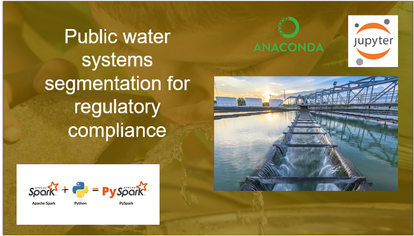

# SDWA Analysis: Water Quality and Compliance

  

  ## Table of contents
- [Overview](#overview)
- [Features](#features)
- [Models Used](#models-used)
- [Visualizations](#visualizations)
- [Conclusions](#conclusion)
- [Limitations](#limitations)
- [Future Work](#future-work)
- [Acknowledgements](#acknowledgements)
  
## Overview
This project analyzes public water systems under the Safe Drinking Water Act (SDWA) to identify compliance patterns and categorize water systems based on violations and features.

## Problem Statement
The project focuses on evaluating and segmenting public water systems based on compliance with regulatory standards. These system's compliance is critical to ensuring public health and evironmental protection. The primary research questions are :
- How can public water systems be effectively segmented based on compliance behaviors and violation patterns?
- What key factors contribute to compliance or non-compliance with regulatory standards?
- Can predictive models acurately classify water system's compliance status to improve monitorin and decision-making?

## Solution Strategy
- Segmenting Water Systems
       - Task: Unsupervised clustering using group 3 variables to create profiles of water systems key variables included compliance status, violation counts, and enforcement action categories
       - Outcome: Identified clusters of water systems based on compliance patterns. This segmentation helped classify systems into high-rish, medium-risk, and low-risk categories, enabling focused regulatory interventions.
    
- Identify key Factors
      - Task: Perform feature importance analysis using supervised machine learning models (e.g., Logistic Regression, Naive Bayes). Key features like major violations, late compliance actions, and "outstanding performer" stuat were analyzed.
      - Outcome: Determined which facotrs have the greatest impact on compliance behavior, allowing stakeholders to prioritize areas for improvement.
    
## Features
- Clustering public water systems for compliance segmentation.
- Analyzing violation trends and feature contributions.
- Dashboard integration with Power BI for interactive insights.

## Models Used
- Unsupervised Models
    - K-MEANS
    - GAUSSIAN MIXTURE MODEL
- Supervised Models
    - Multinomial Logistic Regression
    - Random Foresst
    - Naive Bayes Classifer

## Visualizations
Clustering Results

  

Compliance Trends

  

## Conclusions
- Clustering Insights:
      - Created 5 distinct clusters with meaningful segmentation of water systems.
    High-risk clusters highlight operational priorities for regulatory actions.
- Compliance Factors:
      - Major violations and late compliance actions are key indicators of system performance.
- Deployment:
       - Power BI dashboard and GitHub repository established.

## Limitations
- Data Constraints
        Limited dataset scope to compliance and violation records; excluded external factors like goeographical data
        Inconsistent data quality (e.g., missing entries, multiple records with different attributes) requiring significant preprocessing.
-  Cluster Interpretation Challenges
        Difficulty in deriving domain-specific explanations for certain clusters due to a lack of contextual metadata.
-  Model Assumptions
        GMM clustering assumes normally distributed data, which might not always reflect real-world compliance behaviors.
- Scalability
        Current deployment pipeline and dashboard are designed for static datasets, limiting their effectiveness with high-volume or live data streams.
- Stakeholder Usability
        The dashboard and repository might require technical expertise for full utilization, creating a learning curve for non-technical users.

## Future Work
- Enhanced Explainability
        - Goal: Integrate Explainable AI (XAI) to improve interpretability of clustering and prediction models.
        - Impact: Enable regulators and stakeholders to understand why certain systems are flagged as high-risk.
- Real-Time Data Integration
        - Goal: Utilize streaming platforms for continuous monitoring of water system compliance.
        - Impact: Ensure proactive detection of emerging compliance issues.
- Expanded Dataset Usage
        - Goal: Incorporate additional data such as geographical, socio-economic, and historical compliance records.
        - Impact: Provide a more comprehensive risk assessment framework.
- Multi-Model Evaluation
        - Goal: Experiment with advanced clustering algorithms (e.g., DBSCAN or Hierarchical Clustering) for comparison with GMM results.
        - Impact: Ensure robustness and adaptability of clustering techniques.
- Predictive Maintenance Models
        - Goal: Develop time-series models to predict future violations based on historical data.
        - Impact: Empower authorities to prevent violations before they occur.

## Acknowledgements
- Data sourced:
    - U.S. Environmental Protection Agency (EPA) [SDWA database](https://echo.epa.gov/tools/data-downloads#drinkingwater)
- Tools Used:
    - Jupyter Notebook, Apache Spark and Python (Pyspark), Power BI for visualization
- Support:
    - This project was developed as part of a capstone course in Datascience at UMBC
